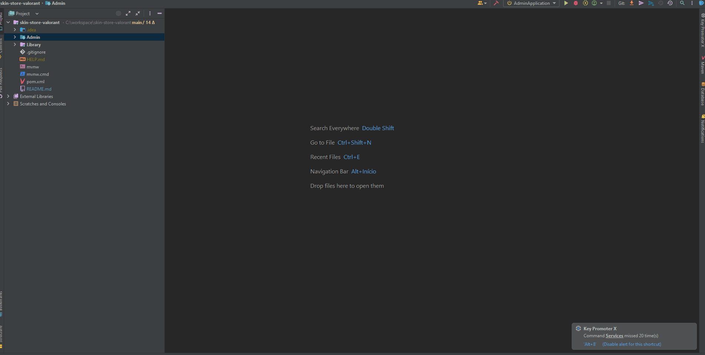

# Skin Store Valorant
___

## Endpoints

```
admin/login{GET} - Página de login.
admin/index{GET} - Página inicial da dashboard administrativa.
admin/register{GET} - Página de registro de usuário
admin/forgot-password{GET} - Página de recuperação de senha.
admin/register-new{POST} - Esse endpoint recebe um objeto AdminDTO como parâmetro e realiza a validação dos dados recebidos. Se a validação for bem-sucedida, ele cria uma nova instância da classe Admin, criptografa a senha do usuário e salva no banco de dados. 
```
___

## Configurando banco de dados MySql, Thymeleaf e Hibernate. (application.properties)
```
server.port=8019
server.servlet.context-path=/admin
spring.thymeleaf.check-template-location=true
spring.thymeleaf.prefix=classpath:/templates/
spring.thymeleaf.suffix=.html
spring.thymeleaf.mode=HTML
spring.thymeleaf.encoding=UTF-8
spring.thymeleaf.content-type=text/html
spring.thymeleaf.cache=false


spring.datasource.url=jdbc:mysql://localhost:3306/skin_store_valorant?createDatabaseIfNotExist=true&serverTimezone=UTC
spring.datasource.username=root
spring.datasource.password=
spring.datasource.driver-class-name=com.mysql.cj.jdbc.Driver
spring.jpa.generate-ddl=true


spring.jpa.properties.hibernate.dialect=org.hibernate.dialect.MySQLDialect


spring.jpa.hibernate.ddl-auto=update
```

<h1 align="center">
   
</h1>


